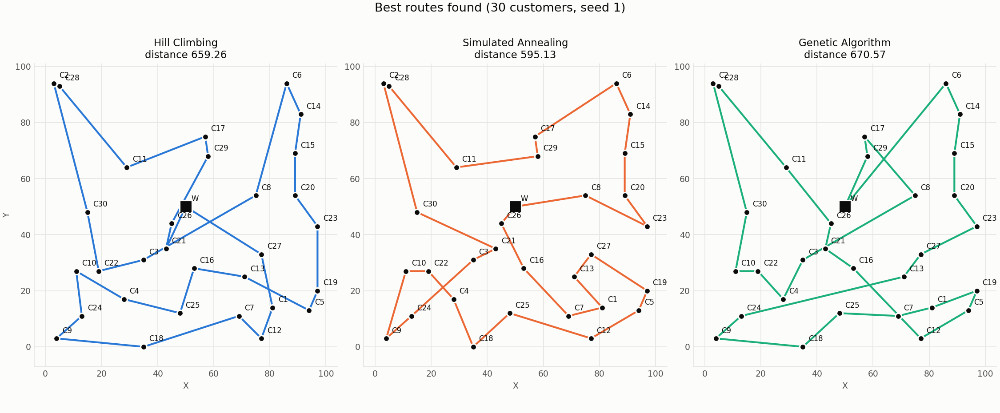
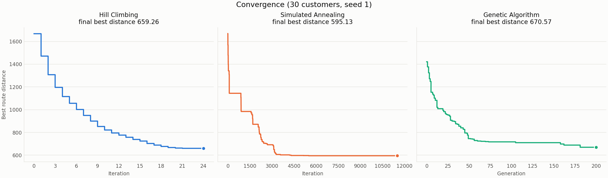
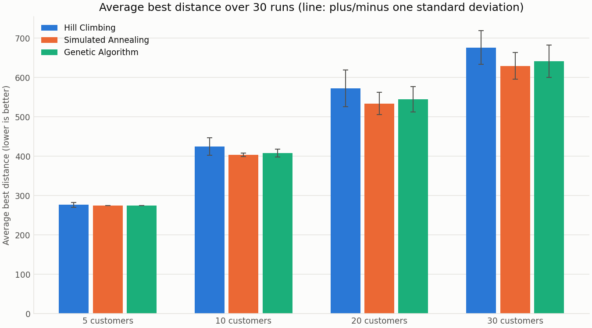

# Comparative Delivery Route Optimization Using Hill Climbing, Simulated Annealing and Genetic Algorithm

AI course project, Module 3 – Local Search. Three search algorithms are
implemented from scratch in Python and compared on the same delivery-routing
problem.

## 1. Problem statement

A delivery company has **one warehouse**, **one vehicle** and **several
customers**. Every location has an ID and X/Y coordinates. The vehicle must:

1. start at the warehouse,
2. visit every customer exactly once,
3. return to the warehouse.

The objective is to **minimize the total travel distance**.

Example route: `W -> C1 -> C4 -> C2 -> C5 -> C3 -> W`

## 2. Motivation

The number of possible routes grows very quickly: with `n` customers there
are `n!` possible orderings (30 customers give about 2.65 x 10^32). Checking
every route is not practical, so we use local search methods that look for a
good route without trying all of them. The project compares how three such
methods behave on the same problem.

## 3. Module

Module 3 – Local Search

- Hill Climbing
- Simulated Annealing
- Genetic Algorithm

## 4. AI formulation

| Part | Definition |
|---|---|
| **State** | A complete ordering (permutation) of all customers, e.g. `[C1, C4, C2, C5, C3]`. The warehouse is fixed at the start and end, so this means `W -> C1 -> C4 -> C2 -> C5 -> C3 -> W`. |
| **Initial state** | A random valid ordering of all customers. |
| **Action** | Swap two customer positions. |
| **Transition model** | A swap gives another ordering that still contains every customer exactly once, so it is another valid route. |
| **Goal test** | Find a route with the minimum possible total distance. These are search methods that try to find high-quality routes; they do **not** guarantee the mathematically best route. |
| **Cost function** | Total route distance, including warehouse -> first customer and last customer -> warehouse. |

Distance between two locations is the Euclidean distance:

```
distance = sqrt((x2 - x1)^2 + (y2 - y1)^2)
```

## 5. Hill Climbing

Code: `algorithms/hill_climbing.py`

Hill Climbing keeps **one** current route and repeatedly tries to improve it.

1. Start from a random route and calculate its distance.
2. Build the **neighbourhood**: every route that can be made by swapping two
   customer positions. For `n` customers there are `n(n-1)/2` neighbours.
3. Calculate the distance of every neighbour and remember the shortest one.
4. **Decision:** if that best neighbour is shorter than the current route,
   move to it. Otherwise stop.
5. Repeat from step 2 until no neighbour is shorter, or the iteration limit
   is reached.

This is the *steepest-descent* form of Hill Climbing: it looks at all
neighbours and takes the best one. The decision in the code is:

```python
# AI DECISION: move to the improving neighbouring route.
if best_neighbour_cost < current_cost:
    current_route = best_neighbour
    current_cost = best_neighbour_cost
```

**Why it works:** every move makes the route strictly shorter, so the
distance can only go down and the search must eventually stop.

**Its weakness:** it stops at the first route that no single swap can
improve. This is a **local optimum**. A shorter route may exist, but reaching
it would need a move that first makes the route longer, and Hill Climbing
never accepts a worse route. Which local optimum it reaches depends on the
random starting route.

Randomness is used only for the starting route. After that the search is
deterministic.

## 6. Simulated Annealing

Code: `algorithms/simulated_annealing.py`

Simulated Annealing also keeps **one** current route and uses the same swap
move, but it is allowed to accept a worse route sometimes. This is what lets
it leave a local optimum.

1. Start from a random route and set the temperature to `initial_temperature`.
2. Make **one** random neighbour by swapping two random customer positions.
3. Calculate `delta = neighbour_cost - current_cost`.
4. **Decision:**
   - if `delta < 0` the neighbour is shorter, so accept it;
   - otherwise calculate `probability = exp(-delta / temperature)`, draw a
     random number between 0 and 1, and accept the worse route only if
     `random_number < probability`.
5. Remember the best route seen so far (the current route may get worse).
6. Cool down: `temperature = temperature * cooling_rate`.
7. Repeat until the temperature falls below `minimum_temperature` or the
   iteration limit is reached.

The decision in the code is:

```python
delta = neighbour_cost - current_cost

if delta < 0:
    # AI DECISION: always accept a better route.
    accept = True
else:
    # AI DECISION: probabilistically accept a worse route based on temperature.
    probability = acceptance_probability(delta, temperature)
    random_number = rng.random()
    accept = random_number < probability
```

**How the temperature controls the search**

| Route is worse by | Temperature 100 | Temperature 10 | Temperature 1 |
|---|---|---|---|
| 10 | exp(-0.1) = 0.905 | exp(-1) = 0.368 | exp(-10) = 0.00005 |
| 50 | exp(-0.5) = 0.607 | exp(-5) = 0.007 | exp(-50) ≈ 0 |

- **High temperature:** worse routes are accepted often, so the search
  explores widely.
- **Low temperature:** worse routes are almost never accepted, so the search
  behaves like Hill Climbing and settles into a good route.
- A slightly worse route is always more likely to be accepted than a much
  worse one.

**Division by zero** cannot happen: the temperature must start above 0, is
only ever multiplied by a positive cooling rate, and the loop stops once it
drops below `minimum_temperature` (which must also be above 0).

Simulated Annealing does not guarantee the shortest route. It only makes
getting stuck in a poor local optimum less likely.

## 7. Genetic Algorithm

Code: `algorithms/genetic_algorithm.py`

The Genetic Algorithm does not improve one route. It keeps a **population**
of routes and builds a new population from it in every **generation**.

- **Chromosome:** one customer ordering, e.g. `[C1, C4, C3, C2, C5]`. The
  warehouse is not part of the chromosome.
- **Fitness:** the route distance itself. This is a minimization problem, so
  a shorter route is a fitter chromosome.

Steps:

1. Create a population of random valid routes and calculate every distance.
2. Copy the best route of the population unchanged into the new population
   (*elitism*), so a good route is never lost.
3. **Selection:** choose two parents by tournament selection.
4. **Crossover:** combine the two parents into one child.
5. **Mutation:** with a small probability, swap two customers of the child.
6. Repeat steps 3–5 until the new population is full, then replace the old
   population with it.
7. Remember the best route seen in the whole run.
8. Repeat from step 2 for the chosen number of generations.

**Tournament selection.** Pick a few routes at random (3 by default) and
keep the shortest of them. Shorter routes win more often, so they become
parents more often, but a weaker route can still be picked if it only meets
weaker rivals. That keeps some variety in the population.

```python
# AI DECISION: the competitor with the shorter route wins.
if costs[index] < costs[winner]:
    winner = index
```

**Order Crossover.** A normal one-point crossover would break the route:

```
parent1 = [C1, C2, C3, C4, C5]
parent2 = [C3, C5, C1, C2, C4]
one-point child = [C1, C2 | C1, C2, C4]   C1 and C2 twice, C3 and C5 missing
```

Order Crossover avoids this:

1. Copy a random slice of parent 1 into the same positions of the child.
2. Fill the empty positions, left to right, with the remaining customers in
   the order they appear in parent 2.

```
parent1 = [C1, C2, C3, C4, C5]
parent2 = [C3, C5, C1, C2, C4]
step 1  = [ _, C2, C3,  _,  _]      slice (positions 1 to 2) from parent1
step 2  = [C5, C2, C3, C1, C4]      C5, C1, C4 in parent2's order
```

Every customer appears exactly once, and the parents are not changed.

**Swap mutation.** With probability `mutation_rate`, two random customers of
the child are swapped. Mutation creates orderings that crossover alone
cannot produce from the current population.

**Best solution tracking.** After every generation the best route of that
generation is compared with the best route of the whole run, and the better
one is kept. The route returned at the end is the best of the whole run.

The Genetic Algorithm does not guarantee the shortest route either.

## 8. Input format

A CSV file (default: `data/input.csv`):

```
ID,X,Y
W,50,50
C1,20,30
C2,70,20
C3,80,70
C4,30,80
C5,60,10
```

- The row with ID `W` is the warehouse.
- Every other row is a customer.
- The file is read when the program runs. No coordinates are written inside
  the code, so any CSV in this format can be used.

Coordinates may be whole or decimal numbers, and may be negative. Blank
lines are ignored. Files saved from Excel as "CSV UTF-8" and files with
Windows line endings are accepted. One customer is enough to run the program.

The loader reports a clear error for: missing file, empty file, wrong header,
wrong number of values in a row, missing ID, missing coordinate, non-numeric
coordinate, duplicate ID, no warehouse, and no customers.

## 9. Output format

For each algorithm the program prints the best route, best distance,
execution time and number of iterations or generations. This is the actual
output of `python3 main.py` (the input data listing printed before it is
left out here; execution times differ slightly on every run):

```
Random seed: 42

==================================================
HILL CLIMBING
==================================================

Initial route:
W -> C4 -> C2 -> C3 -> C5 -> C1 -> W

Distance of that route:
303.18

Best route:
W -> C4 -> C3 -> C2 -> C5 -> C1 -> W

Best distance:
232.95

Execution time:
0.0000 seconds

Iterations:
2

Stopped because:
local optimum (no improving neighbour)

==================================================
SIMULATED ANNEALING
==================================================

Initial route:
W -> C4 -> C2 -> C3 -> C5 -> C1 -> W

Distance of that route:
303.18

Best route:
W -> C4 -> C3 -> C2 -> C5 -> C1 -> W

Best distance:
232.95

Execution time:
0.0379 seconds

Iterations:
11508

Stopped because:
minimum temperature reached

==================================================
GENETIC ALGORITHM
==================================================

Best route in the initial population:
W -> C3 -> C2 -> C5 -> C1 -> C4 -> W

Distance of that route:
232.95

Best route:
W -> C4 -> C3 -> C2 -> C5 -> C1 -> W

Best distance:
232.95

Execution time:
0.0774 seconds

Generations:
200

Stopped because:
generation limit reached
```

After the three results the program prints a comparison table. Each
algorithm is run several times (`--runs`, default 10) with seeds 42, 43, ...
This is the actual table for `data/input.csv`:

```
COMPARISON OVER 10 RUNS (seeds 42 to 51)
Algorithm             Best Distance  Average Distance   Std Dev  Execution Time (s)  Iterations/Generations  Route Evaluations
------------------------------------------------------------------------------------------------------------------------------
Hill Climbing                232.95            232.95      0.00              0.0000                     2.4               25.0
Simulated Annealing          232.95            232.95      0.00              0.0379                 11508.0            11509.0
Genetic Algorithm            232.95            232.95      0.00              0.0778                   200.0            10050.0
```

- **Std Dev** is the standard deviation of the best distance over the runs.
  A small value means the algorithm gives similar results every time.
- **Execution Time**, **Iterations/Generations** and **Route Evaluations**
  are averages per run.
- **Route Evaluations** is the number of routes whose distance was
  calculated. It measures the work done in the same unit for all three
  algorithms.

The unit of work is different for each algorithm:

- **Hill Climbing iteration:** one full look at the whole neighbourhood
  (every possible swap). The last iteration is the one that finds no
  improving neighbour.
- **Simulated Annealing iteration:** one random swap tried.
- **Genetic Algorithm generation:** one complete new population created and
  evaluated.

All algorithms are given the same seed. Hill Climbing and Simulated
Annealing therefore start from the same random initial route.

Note on this small sample: with only 5 customers there are just 120 possible
routes. Checking all of them shows that 232.95 is the shortest possible
route for `data/input.csv`, and the Genetic Algorithm's first random
population of 50 already contains such a route. The sample also has more than one route of length
232.95, which is why two different routes with the same distance appear in
the Genetic Algorithm output. The differences between the algorithms show up
on larger inputs (see the experiment results in section 13).

### Plots

`python3 main.py` also saves two plots of the first run (the one that used
`--seed`) in the `results` folder. Use `--no-plots` to skip them.

| File | What it shows |
|---|---|
| `results/routes.png` | One map per algorithm: the warehouse (square), the customers (dots) with their IDs, and the best route found. The distance is in the title. |
| `results/convergence.png` | One panel per algorithm: best route distance (y-axis) after each iteration or generation (x-axis). |

The experiment runner saves the same two plots for every dataset size (first
run, seed 1) and one comparison chart:

| File | What it shows |
|---|---|
| `results/routes_N_customers.png` | Best routes for the dataset with N customers. |
| `results/convergence_N_customers.png` | Convergence for the dataset with N customers. |
| `results/comparison_chart.png` | Average best distance of each algorithm for each dataset size. The thin line on each bar is plus/minus one standard deviation over the 30 runs. |

Every plotted value comes from the result of an actual run. Nothing is
typed in by hand.

Example, 30 customers, seed 1:





Comparison over 30 runs:



**How to read the convergence plot**

- The three panels share the y-axis, so the distances can be compared
  directly.
- They do **not** share the x-axis, because one step is a different amount
  of work for each algorithm (one whole neighbourhood, one swap, one whole
  population). The plot shows the *shape* of each search, not which one is
  faster. For the amount of work, use the Route Evaluations column of the
  comparison table.
- Hill Climbing goes down in a few large steps and then stops. Simulated
  Annealing drops quickly, then improves in smaller steps as the temperature
  falls, and is flat at the end when almost no worse route is accepted. The
  Genetic Algorithm improves over many generations, with long flat stretches
  between improvements.
- The route and convergence plots show **one** run. One run can differ from
  the average: in the 30-customer example above, Hill Climbing (659.26) is
  shorter than the Genetic Algorithm (670.57), although over 30 runs the
  Genetic Algorithm has the shorter average (641.50 against 676.29). Use the
  comparison chart and table to compare the algorithms.

## 10. Installation

Python 3.10 or newer is required. The algorithms use only the Python
standard library. Matplotlib is needed only for the plots. Without it the
program still runs and prints all results, and only the plots are skipped.

```
pip install -r requirements.txt
```

No other library is used. In particular, no optimization, machine learning
or AI library is used: Hill Climbing, Simulated Annealing and the Genetic
Algorithm are written in this project's own code in the `algorithms` folder.

## 11. How to run

```
python3 main.py
python3 main.py --input data/customers_20.csv --seed 42 --runs 10
```

| Option | Meaning | Default |
|---|---|---|
| `--input` | path to the input CSV file | `data/input.csv` |
| `--seed` | random seed of the first run | `42` |
| `--runs` | number of runs behind the comparison table | `10` |
| `--no-plots` | do not save the plots | plots are saved |

The detailed result printed for each algorithm is the run that used
`--seed`. The comparison table uses seeds `seed`, `seed + 1`, ... The same
seed always gives the same routes and distances.

Run the tests:

```
python3 -m unittest discover -s tests -v
```

## 12. How to generate datasets

```
python3 data/generate_data.py
```

creates `data/customers_5.csv`, `customers_10.csv`, `customers_20.csv` and
`customers_30.csv`. To create one dataset of any size:

```
python3 data/generate_data.py --customers 15 --seed 7 --output data/my_data.csv
```

The data is synthetic. The warehouse `W` is at the centre (50, 50) of a
100 x 100 map and every customer gets random whole-number coordinates
between 0 and 100. No two locations share a position. The same seed always
produces the same file (default seed: 42).

## 13. How to run experiments

```
python3 experiments/run_experiments.py
python3 experiments/run_experiments.py --runs 10 --sizes 5 10
```

For each dataset size (5, 10, 20 and 30 customers) the script:

1. generates the dataset (dataset seed 42),
2. runs each algorithm 30 times, with seeds 1 to 30,
3. checks that every returned route is valid,
4. prints a comparison table.

All three algorithms get the same datasets, the same seeds, the same
distance function and the parameters from `config.py`. The numbers are saved
in `results/experiment_summary.csv` (one row per size and algorithm) and
`results/experiment_runs.csv` (one row per single run), together with the
plots described in section 9. Running the script again overwrites those
files. Use `--no-plots` to skip the plots.

### Results

These are the actual results of `python3 experiments/run_experiments.py`
(30 runs per algorithm). Distances are the same on every machine because
the seeds are fixed; times depend on the computer.

| Customers | Algorithm | Best | Average | Std Dev | Worst | Time (s) | Iterations / Generations | Route evaluations |
|---|---|---|---|---|---|---|---|---|
| 5 | Hill Climbing | 274.31 | 276.69 | 6.18 | 292.19 | 0.0001 | 2.9 | 29.7 |
| 5 | Simulated Annealing | 274.31 | 274.31 | 0.00 | 274.31 | 0.0381 | 11508.0 | 11509.0 |
| 5 | Genetic Algorithm | 274.31 | 274.31 | 0.00 | 274.31 | 0.0777 | 200.0 | 10050.0 |
| 10 | Hill Climbing | 398.58 | 424.62 | 22.46 | 483.57 | 0.0007 | 6.3 | 283.0 |
| 10 | Simulated Annealing | 398.58 | 403.95 | 4.64 | 415.69 | 0.0510 | 11508.0 | 11509.0 |
| 10 | Genetic Algorithm | 398.58 | 408.33 | 9.92 | 429.84 | 0.0932 | 200.0 | 10050.0 |
| 20 | Hill Climbing | 499.00 | 572.71 | 46.43 | 687.79 | 0.0138 | 15.0 | 2857.3 |
| 20 | Simulated Annealing | 479.47 | 533.97 | 28.30 | 581.81 | 0.0770 | 11508.0 | 11509.0 |
| 20 | Genetic Algorithm | 480.26 | 544.78 | 32.42 | 591.56 | 0.1255 | 200.0 | 10050.0 |
| 30 | Hill Climbing | 608.78 | 676.29 | 42.65 | 818.01 | 0.0705 | 23.6 | 10267.0 |
| 30 | Simulated Annealing | 577.97 | 629.33 | 33.85 | 694.24 | 0.1009 | 11508.0 | 11509.0 |
| 30 | Genetic Algorithm | 571.19 | 641.50 | 41.44 | 757.52 | 0.1535 | 200.0 | 10050.0 |

### What the results show

- **5 customers:** all three algorithms found the same best route (274.31).
  Simulated Annealing and the Genetic Algorithm found it in all 30 runs.
  Hill Climbing found it in 26 of 30 runs and stopped at a longer local
  optimum in the other 4.
- **10 customers:** all three found the same best route (398.58) at least
  once, but the averages differ: Simulated Annealing 403.95, Genetic
  Algorithm 408.33, Hill Climbing 424.62.
- **20 and 30 customers:** Hill Climbing has the longest average route and
  the largest variation. Simulated Annealing has the shortest average at both
  sizes, and the Genetic Algorithm is second. The gap between Simulated
  Annealing and the Genetic Algorithm (about 11 to 12) is small compared with
  the variation between runs (standard deviation about 28 to 41), so these
  runs do not show a clear winner between those two. At 30 customers the
  single shortest route of all (571.19) came from the Genetic Algorithm.
- **Consistency:** Hill Climbing varies the most from run to run, because
  the local optimum it reaches depends completely on the random starting
  route.
- **Time:** Hill Climbing is the fastest at every size. Simulated Annealing
  takes less time than the Genetic Algorithm at every size (about half at
  5 customers, about two thirds at 30) for a similar number of route
  evaluations.

### Is the comparison fair?

Simulated Annealing (11,509 route evaluations) and the Genetic Algorithm
(10,050) are given a similar amount of work at every size. Hill Climbing
stops by itself when it reaches a local optimum, so the work it does grows
with the problem: about 30 evaluations for 5 customers, 2,857 for 20 and
10,267 for 30. Its results on the small datasets therefore come from far
less work, and giving it more iterations would not help, because it cannot
move once no swap improves the route. At 30 customers all three do a similar
amount of work, and Hill Climbing still has the longest average route.

### Limits of these experiments

- One dataset per size. Other datasets could give different numbers.
- The parameters were chosen once as reasonable values and were not tuned.
  Different parameters could change the order of Simulated Annealing and
  the Genetic Algorithm.
- For 5 customers all 120 possible routes were checked directly, and 274.31
  is the shortest possible route. For 10, 20 and 30 customers the true
  shortest route is not known, so there the results only compare the
  algorithms with each other.

## 14. Parameters

All parameters are in `config.py`. `main.py` and the experiment runner both
read them from there.

**Hill Climbing**

| Parameter | Value | Meaning |
|---|---|---|
| `HC_MAX_ITERATIONS` | 1000 | Safety limit on iterations. Normally the search stops earlier, at a local optimum. |

**Simulated Annealing**

| Parameter | Value | Meaning |
|---|---|---|
| `SA_INITIAL_TEMPERATURE` | 100.0 | Starting temperature. Chosen to be of the same order as the distance change one swap causes on a 100 x 100 map, so worse routes are accepted often at the start. |
| `SA_COOLING_RATE` | 0.999 | The temperature is multiplied by this after every iteration. |
| `SA_MINIMUM_TEMPERATURE` | 0.001 | The search stops when the temperature falls below this. |
| `SA_MAX_ITERATIONS` | 20000 | Safety limit on iterations. |

With these values the temperature reaches the minimum after 11,508
iterations, so that is where the search normally stops.

**Genetic Algorithm**

| Parameter | Value | Meaning |
|---|---|---|
| `GA_POPULATION_SIZE` | 50 | Number of routes in the population. |
| `GA_GENERATIONS` | 200 | Number of new populations created. |
| `GA_TOURNAMENT_SIZE` | 3 | Number of routes compared in each selection. |
| `GA_MUTATION_RATE` | 0.2 | Probability that a child has two customers swapped. |

The best route of each generation is always copied into the next one
(elitism of one route).

**Amount of work.** The Genetic Algorithm calculates
50 x (200 + 1) = 10,050 route distances per run, and Simulated Annealing
11,509, so those two do a similar amount of work. Hill Climbing does much
less on small inputs because it stops as soon as it reaches a local optimum.

**Experiments**

| Parameter | Value | Meaning |
|---|---|---|
| `DEFAULT_RUNS` | 10 | Runs behind the comparison table in `main.py`. |
| `EXPERIMENT_SIZES` | 5, 10, 20, 30 | Numbers of customers tested. |
| `EXPERIMENT_RUNS` | 30 | Runs of every algorithm on every dataset. |
| `EXPERIMENT_DATASET_SEED` | 42 | Seed used to generate the datasets. |

## 15. Project structure

```
delivery-route-optimization/
├── data/
│   ├── input.csv                sample input
│   ├── generate_data.py         synthetic dataset generator
│   └── customers_N.csv          generated datasets (5, 10, 20, 30)
├── algorithms/
│   ├── hill_climbing.py
│   ├── simulated_annealing.py
│   └── genetic_algorithm.py
├── utils/
│   ├── data_loader.py           reads and checks the CSV
│   ├── distance.py              Euclidean distance and the route cost function
│   ├── route.py                 route representation, swap action, validation
│   ├── comparison.py            runs the algorithms several times, comparison table
│   └── visualization.py         route plot, convergence plot, comparison chart
├── experiments/
│   └── run_experiments.py       experiments on 5/10/20/30 customers
├── results/                     written by main.py and the experiment runner
│   ├── experiment_summary.csv
│   ├── experiment_runs.csv
│   └── *.png                    plots
├── tests/                       unit tests
├── config.py                    all parameters
├── main.py
├── requirements.txt
└── README.md
```

## 16. Limitations

- One warehouse and one vehicle only.
- Straight-line (Euclidean) distances, not real roads.
- No vehicle capacity, time windows or traffic.
- The algorithms are heuristic: they look for a good route and do not
  guarantee the shortest possible one.

## 17. External AI tool declaration

Claude was used as a supporting programming assistant for code drafting,
debugging, documentation and test-data generation. The AI algorithms and
their decision-making logic were implemented in the project code and
verified by the project members.
